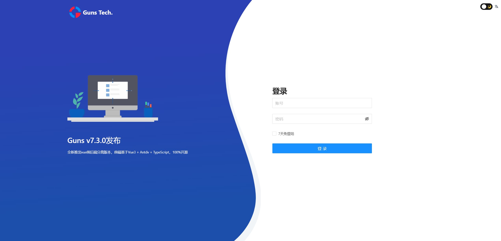
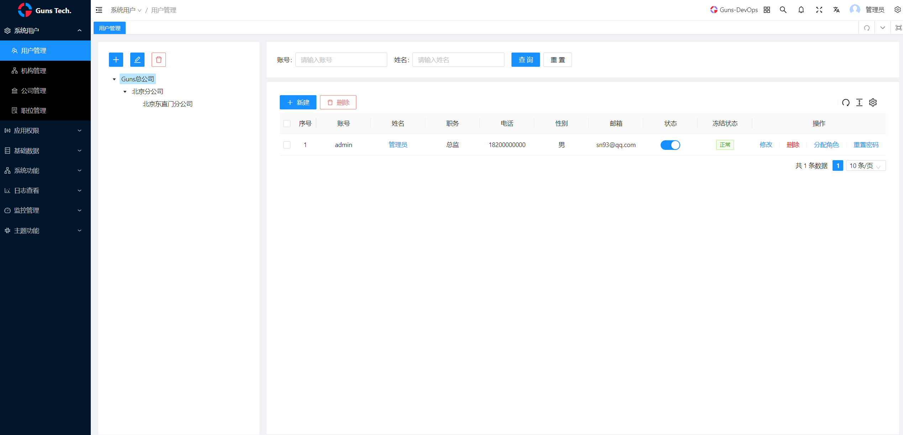
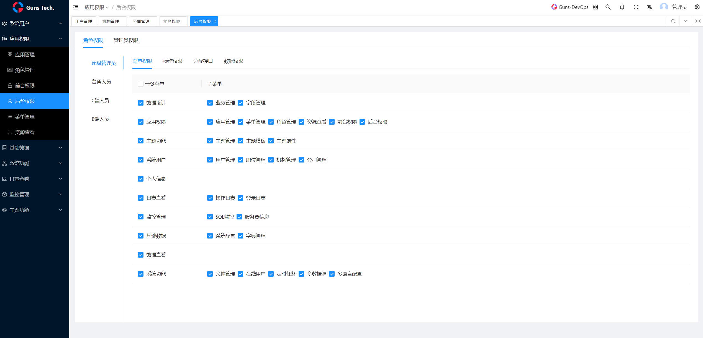
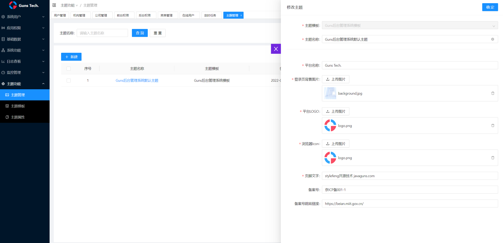

## 简介

Guns 7.3.0，前端采用Vue Vben Admin。使用了最新的`vue3` + `vite2` + `TypeScript`等主流技术开发，开箱即用的整套架构，也可用于学习参考。

## 文档

[Guns文档地址](https://javaguns.com/doc)

[Vben前端文档地址](https://vvbin.cn/doc-next/)

## 运行效果









## 特性

- **最新技术栈**：使用 Vue3/vite2 等前端前沿技术开发
- **TypeScript**: 应用程序级 JavaScript 的语言
- **主题**：可配置的主题
- **国际化**：内置完善的国际化方案
- **Mock 数据** 内置 Mock 数据方案
- **权限** 内置完善的动态路由权限生成方案
- **组件** 二次封装了多个常用的组件

## 准备

- [node](http://nodejs.org/) 和 [git](https://git-scm.com/) -项目开发环境
- [Vite](https://vitejs.dev/) - 熟悉 vite 特性
- [Vue3](https://v3.vuejs.org/) - 熟悉 Vue 基础语法
- [TypeScript](https://www.typescriptlang.org/) - 熟悉`TypeScript`基本语法
- [Es6+](http://es6.ruanyifeng.com/) - 熟悉 es6 基本语法
- [Vue-Router-Next](https://next.router.vuejs.org/) - 熟悉 vue-router 基本使用
- [Ant-Design-Vue](https://2x.antdv.com/docs/vue/introduce-cn/) - ui 基本使用
- [Mock.js](https://github.com/nuysoft/Mock) - mockjs 基本语法

## 安装使用

请先安装**Node 18**和**pnpm**。

- 安装 Node 18
```
## 检查node版本
node -v
npm view node versions
## npm安装node
sudo npm cache clean -f
sudo npm install -g n
# 安装最新版本
sudo n latest
# 安装指定版本
sudo n 18.18.2
```

- 安装 pnpm
```
sudo npm i -g pnpm
```

- 通过pnpm 安装依赖
```
pnpm i vue -S
pnpm install
```

- 运行

```bash
pnpm run dev
```

- 打包

```bash
pnpm run build
```

## License

保留作者原有MIT协议，详见如下：

[MIT © Vben-2020](./LICENSE)
